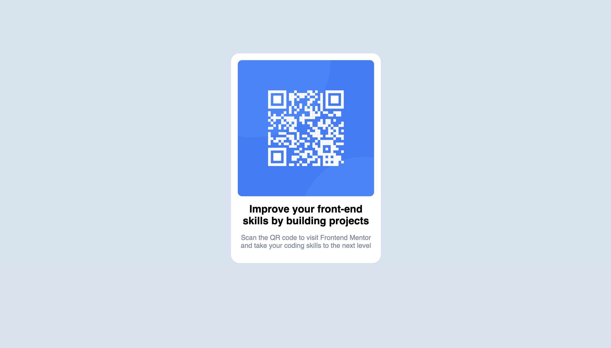

# Frontend Mentor - QR code component solution

This is a solution to the [QR code component challenge on Frontend Mentor](https://www.frontendmentor.io/challenges/qr-code-component-iux_sIO_H). Frontend Mentor challenges help you improve your coding skills by building realistic projects.

## Table of contents

- [Overview](#overview)
  - [Screenshot](#screenshot)
  - [Links](#links)
- [My process](#my-process)
  - [Built with](#built-with)
- [Author](#author)

## Overview

This is my first challenge on frontend mentor and i was just testing out how all this works!!

Very useful website and i look forward to taking on more challenges.

### Screenshot

### Links

- Solution URL: [https://github.com/Sigurdur-ari/qr-code-template](https://github.com/Sigurdur-ari/qr-code-template)
- Live Site URL: [https://sas-qr-template.netlify.app](https://sas-qr-template.netlify.app)

## My process

### Built with

- Semantic HTML5 markup
- CSS custom properties
- Flexbox

## Author

- Frontend Mentor - [@Sigurdur-ari](https://www.frontendmentor.io/profile/Sigurdur-ari)
